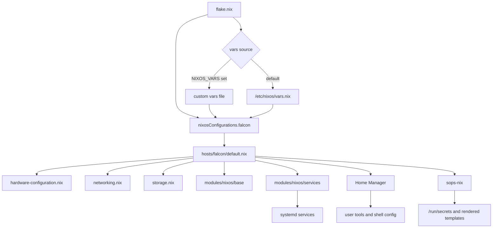
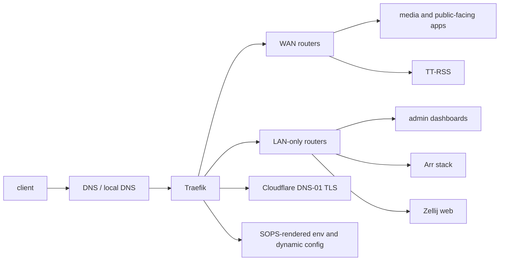
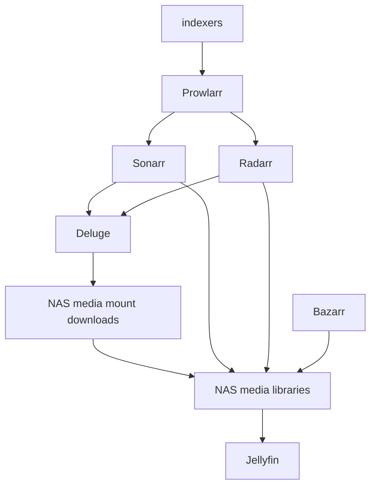
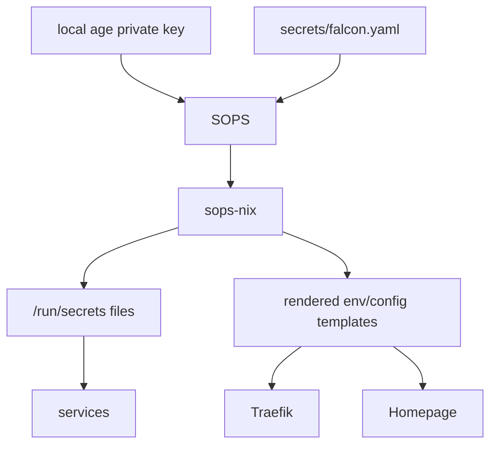
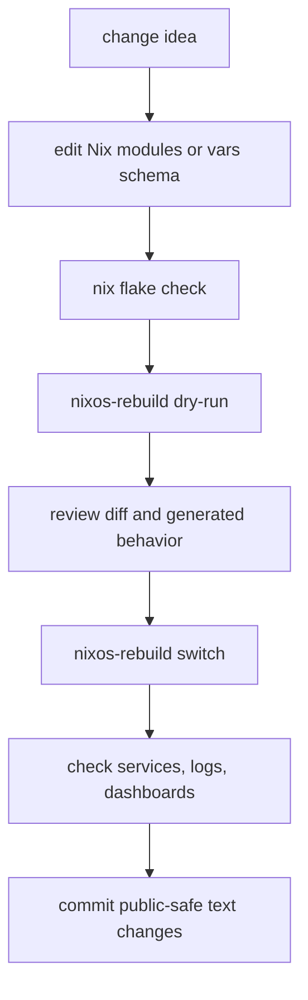
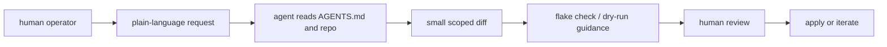

# Falcon Homelab

This is my homelab setup: a flake-based NixOS configuration for one host named
`falcon`, as in the Millennium Falcon. It is not the prettiest ship in the
hangar, but it is mine, it does a lot, and I would very much like it to keep
working predictably.

The operating idea is simple: keep the machine reproducible, keep the
operational knowledge in text, and make changes through reviewable diffs
instead of clicking around until something works. This is not meant to be a
universal homelab framework. It is the setup I actually run, cleaned up enough
to be useful as a reference.

## What This Repo Does

- Builds `nixosConfigurations.falcon` from `flake.nix`.
- Keeps host-specific inventory in ignored `vars.nix`.
- Tracks a public-safe `vars.example.nix` schema for anyone reading or reusing
  the setup.
- Uses `sops-nix` for encrypted secrets.
- Splits base OS concerns, host concerns, and services into small Nix modules.
- Runs the main apps behind Traefik with TLS and clear LAN/WAN boundaries.
- Uses Home Manager for user-level tools, shell config, Starship, tmux, and
  Zellij web sessions.
- Runs automatic flake upgrades, garbage collection, and store optimization.

## Layout

```text
.
├── flake.nix
├── flake.lock
├── hosts/falcon/
│   ├── default.nix
│   ├── hardware-configuration.nix
│   ├── networking.nix
│   └── storage.nix
├── modules/nixos/base/
│   ├── auto-upgrade.nix
│   ├── packages.nix
│   └── users.nix
├── modules/nixos/services/
├── home/zx/default.nix
├── secrets/
│   ├── falcon.yaml
│   └── README.md
├── vars.example.nix
└── AGENTS.md
```

`vars.nix` is intentionally ignored. It contains the real local inventory:
hostnames, addresses, service ports, DNS names, Git identity, and other
site-specific non-secret values. Secrets go in SOPS, not in `vars.nix`.

## Configuration Flow



The flake is intentionally impure for local evaluation because it reads an
ignored `vars.nix` file. That keeps the public repo reusable while still letting
the live host keep its real inventory out of Git.

## Services

| Area | Modules |
| --- | --- |
| DNS and ingress | AdGuard Home, Traefik, ddclient |
| Media | Jellyfin, Audiobookshelf, Immich |
| Downloads and automation | Deluge, Sonarr, Radarr, Prowlarr, Bazarr |
| Files and feeds | Copyparty, Tiny Tiny RSS |
| Remote access | WireGuard, Zellij web |
| Games and voice | Paper Minecraft, TeamSpeak |
| Dashboard | Homepage |

Service modules live under `modules/nixos/services/` and are imported from
`hosts/falcon/default.nix`. When a service needs site-specific values, it reads
from `vars`. When it needs secrets, it reads from SOPS.

## Request Routing



Traefik is the main front door. The module keeps routers, TLS, middleware, and
service targets together so exposure changes are visible in one place. LAN-only
routes use IP allow-listing for the local network, WireGuard ranges, and
loopback.

## Media Flow



The Arr stack is designed around a shared NAS media mount. Downloads and final
libraries live under the same mounted storage, which keeps completed torrent
handling friendly to hardlinks and seeding.

## Secrets



Tracked encrypted secrets live in `secrets/falcon.yaml`. The private age key is
not part of the repo. Plaintext legacy files are ignored and should not get new
consumers.

The rough rule:

- `vars.nix`: private, non-secret local inventory.
- `secrets/falcon.yaml`: encrypted secrets.
- `vars.example.nix`: fake public schema.
- tracked Nix files: behavior and structure only.

## Day-To-Day Management

The normal validation target is:

```sh
sudo nixos-rebuild dry-run --impure --flake path:/etc/nixos#falcon
```

The normal apply command is:

```sh
sudo nixos-rebuild switch --impure --flake path:/etc/nixos#falcon
```

There is also a tracked pre-commit hook:

```sh
nix flake check --impure --no-write-lock-file
```

Automatic maintenance runs from the NixOS config:

- daily automatic flake upgrade checks against `path:/etc/nixos#falcon`
- weekly garbage collection
- weekly store optimization
- no automatic reboot

## Change Flow



The key win is that almost everything important becomes a diff. Service routing,
ports, packages, secrets wiring, user tools, upgrade policy, and storage mounts
are all text. That makes the system easier to reason about, easier to review,
and easier to rebuild.

## Agentic Workflow

This repo is set up to work well with an agentic coding flow. `AGENTS.md`
captures the operational rules: what is public-safe, where new modules should
go, how to validate changes, and which files are intentionally ignored.



Why this works well here:

- NixOS gives the agent a deterministic target instead of a pile of manual
  server state.
- The repo structure is regular: host modules, base modules, service modules,
  Home Manager, secrets, and vars.
- The public/private split is explicit.
- Validation commands are documented and repeatable.
- Most changes can be reviewed as normal Git diffs before they touch the host.

The result is a nice middle ground: I can move quickly, but the ship still
stays boring in the best possible way.

## Reusing This

This repo is tailored to `falcon`, but the pattern is reusable:

1. Copy `vars.example.nix` to an ignored `vars.nix`.
2. Replace the placeholder inventory with your own values.
3. Create your own SOPS age key and encrypted secrets file.
4. Adjust the imported service modules to match what you actually run.
5. Validate with `nix flake check --impure --no-write-lock-file`.
6. Dry-run before switching.

Expect to edit the service set. This is a homelab config, not a product.
